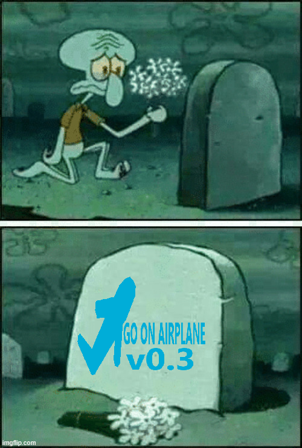

# **DEPRECATED**

[Updated website](https://github.com/goonairplanes/website)

  
    
  
Here lies Go on Framework v0.3 – Buggy, broken, ugly, janky, frozen, but it was the one that built the first page of Go on Airplanes. Rest in peace, SVG airplane I grabbed from Google and turned into a solid color... and we won’t forget the typo on the banner that was supposed to say “Go on Airplanes” but ended up as “Go on Airplane”...

    
  

    <em>Built with makeshift solutions, effort, a miracle, and a lot of ritual.</em>
  

